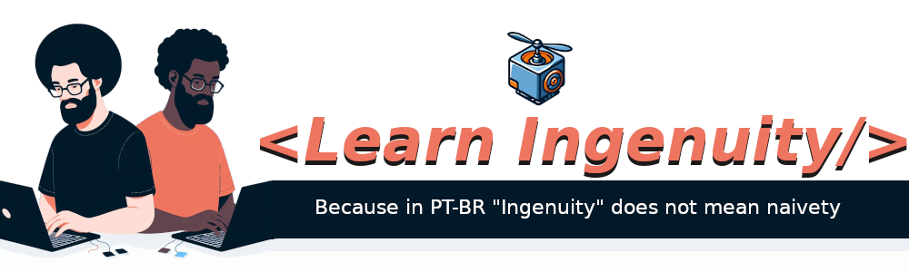

# José Antonio Ribeiro

<!-- 
    Logo image generated by Bing IA: https://www.bing.com/images/create/
-->

### 👋🏾 Olá:
Olá, eu sou o Zé! Desenvolvedor com mais de 15 anos de experiência e apaixonado por resolver problemas usando tecnologia. Nos ultimos anos tive foco em _microsserviços_ e _grande volume de dados_. Curioso e estudando sobre como a IA e novas tecnologias impactam o mercado e a sociedade.

Explorando escrever [artigos](https://dev.to/learningenuity) como processo de documentação dos meus experimentos e leituras constantes

Durante a pandemia, explorei a Robótica e IoT como hobby.

Seja Bem-vindo ao meu GitHub!

  <!--  -->

---

### 🕸️ Redes:

<!-- 
    https://dev.to/envoy_/150-badges-for-github-pnk
-->
     

---

### 🧰 Toolkit:

<!-- 
    icons by:
    https://devicon.dev/
    https://simpleicons.org/
-->
             

