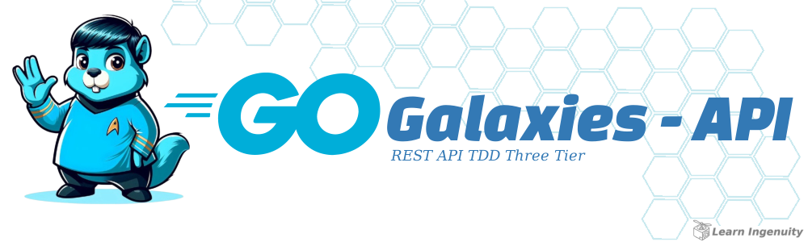
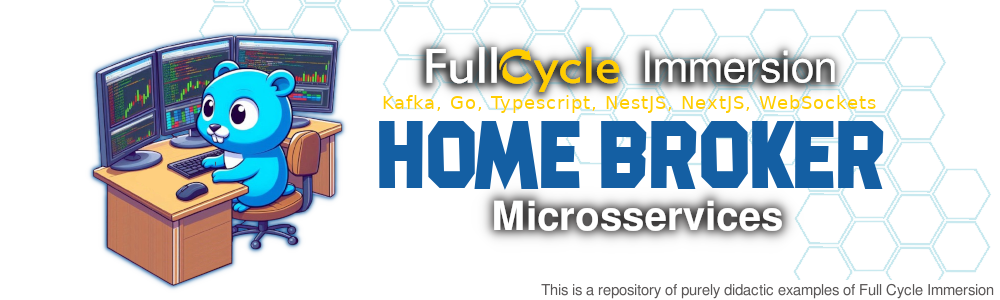
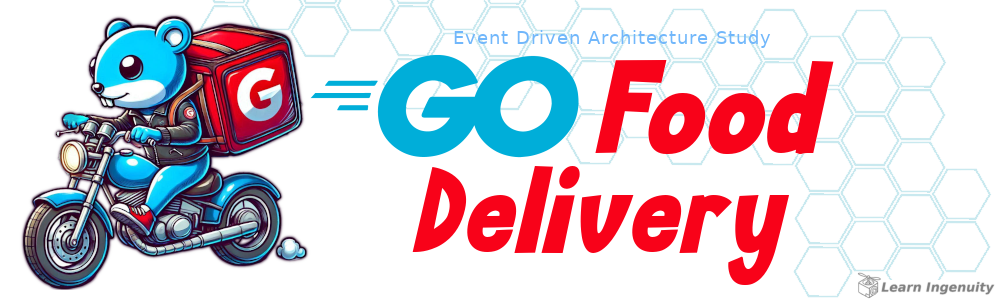

<!--
Lang: [`🇧🇷 PT-BR`] - [🇺🇸 EN](./README_en.md) 
Languages:  - [`🇺🇸 EN`] - [🇧🇷 PT-BR](./README.md) 
-->

 

<a href="#header">
  <!-- 
      Logo image generated by Bing IA: https://www.bing.com/images/create/
  -->
   
</a>

     

---

 

###  Olá Mundo:

Olá Mundo, eu sou o _&nbsp;&nbsp;["Zé" ou "Tony"](https://www.linkedin.com/in/jos%C3%A9-r-99896a39/)_, (depende de onde nos conhecemos), desenvolvedor, curioso e apaixonado por __resolver Problemas de Pessoas usando Tecnologia__. Sou leitor constante de livros e artigos e consumidor habitual de conteúdos que me enriqueçam de maneira pessoal e profissional (e.g., vídeos, podcasts...). Nos últimos anos, meu foco tem sido em __Microsserviços e Grande Volume de Dados__, além de estudar como a IA e novas tecnologias impactam o mercado e a sociedade.

Bem-vindo ao meu GitHub!

- 🔭 Atualmente estou trabalhando em: _Aperfeiçoar minhas Skills_
- 🌱 Atualmente estou aprendendo: _&nbsp;&nbsp;[Observabilidade](https://github.com/jtonynet/jtonynet/tree/main/certificados/alura/SRE-Itau#header)_ e _Event-Driven Architecture_
- 👯 Estou procurando colaborar em: _Ajudar sua empresa a Escalar_
- 💬 Pergunte-me sobre: _Microsserviços_
- 📫 Como entrar em _&nbsp;&nbsp;[Contato Comigo](#contacts)_
- 😄 Pronomes: _Ele, dele_
- 📋 Meu _&nbsp;&nbsp;[Dashboard Miro Público](https://miro.com/app/board/uXjVLwog0e8=/?moveToViewport=-10284,-6053,22200,8500)_
- 📚 Minhas _&nbsp;&nbsp;[Leituras Recentes](https://github.com/jtonynet/jtonynet/tree/main/reading_diary#header)_
- 🎓 Meus _&nbsp;&nbsp;[Certificados e Cursos](https://github.com/jtonynet/jtonynet/tree/main/certificados/alura#header)_
- 🦾 Durante a pandemia, me dediquei a _&nbsp;[ Robótica básica e IoT como hobby](https://github.com/jtonynet/autogo)_.
- ⚡ Curiosidade: _Sou Aquarista e Maker nas horas vagas_

 

`Lifelong learning!`

 
 
 

[⤴️ de volta ao menu](#header)

---

 

### 🕸️ Redes:

<!-- 
    https://dev.to/envoy_/150-badges-for-github-pnk
-->

   

 

[⤴️ de volta ao menu](#header)

---

 

### 📈 Estatísticas Git:

 

<!--
  
 -->

 

[⤴️ de volta ao menu](#header)

---

 

### 🧰 Toolkit:

<!-- 
    icons by:
    https://devicon.dev/
    https://simpleicons.org/
-->
                   

 

[⤴️ de volta ao menu](#header)

---

 

### 🤖 Uso de IA:

O cabeçalho desta página foi criado com o auxílio de inteligência artificial e um mínimo de 
retoque e construção no Gimp 

__Foram utilizados os seguintes prompts para sua criação no [Bing IA:](https://www.bing.com/images/create/)__

  
<b>Drone Ingenuity</b>

<i>"gostaria de uma logo MAIS SIMPLIFICADA O POSSIVEL em cores azul e DETALHES laranja CHAPADAS BEM DEFINIDAS em estilo cartoon/historia em quadrinhos do ROBO AEREO  que a nasa enviou para marte, Ingenuity, basicamente um CUBO com uma UNICA E SOMENTE UMA HELICE UM UNICO ROTOR, UM UNICO MOTOR  no MEIO, NO CENTRO em fundo branco para que seja facil tornar transparente em um editor de imagem"<b>(sic)</b></i>

 

IA também é utilizada em minhas pesquisas e estudos como ferramenta de apoio; no entanto, __artes e desenvolvimento são, sobretudo, atividades criativas humanas.__

Contrate artistas para projetos comerciais ou mais elaborados e Aprenda Engenhosidade!

 

[⤴️ de volta ao menu](#header)

---

 

### 🌟 Desafios e Estudos de Destaque:

Aqui você pode encontrar, através dos cabeçalhos e de uma breve descrição, meus projetos pessoais e treinamentos recentes, desenvolvidos com base em desafios práticos e estudos.

 

. . . . . . . . . . . . . . . . . . . . . . . . . . . .

 

#### ⚔️ Desafios:

> 

> <a href="https://github.com/jtonynet/go-payments-api?tab=readme-ov-file#header">
>
> | Go Payments API (A Hexagonal Approach)              |
> | -----------------------------------------------------|
> |  |
> 
> </a>
> 

>
>     
> 
> 
>
> Desafio de `Payment Authorizer` de benefícios em `Hexagonal Architecture` com `100ms SLA` por request e controle de concorrência com baixa possibilidade de colisão. 
> Construído com `Gin` e `Gorm`, protocolo `gRPC` entre o serviço `REST` `HTTP` ("aberto" ao mundo, o ponto de entrada) e o serviço `Processor` ("fechado" ao mundo, o processador de pagamentos) por segurança.
>
> __Principais Tecnologias e abordagens:__
> - `Hexagonal Architecture`
> - `TDD`, `DDD`, `SOLID`, `ADRs`
> - `REST` `HTTP` e `gRPC` entre `Microsservices`
> - `Dockerized` Solução com uso de containers
> - `PostgreSQL` modelado inspirado em `Event Sourcing` garantindo `Consistency`
> -  `Concurrent Programming`
> - `Redis` para `Pessimistic Memory Lock`
> - `Redis Keyspace Notification` como `Pub/Sub` para `Unlocks`  (`Robust Queues` foram desconsideradas devido `Additional Latency`)
> - `CI` com `GitHub Actions` 
> - `Performance/Load Test Dockerized` com `Gatling`
> - `Diagram as code` com `Mermaid.js` e `Miro`
> - `Observability` (WIP)
>   - `Prometheus` e `Grafana` para `RED Metrics`
>   - `Grafana Loki` e `Promtail` para `Logs`

<!--

 

. . . . . . . . . . . . . . . . . . . . . . . . . . . .

 

> 

> 
> | Go Med Planner (REST API Three Tier with TDD Approach)    |
> | ------------------------------------------------------------------|
> |  |
> 

>
> Desafio ...

 

. . . . . . . . . . . . . . . . . . . . . . . . . . . .

 

> 

> 
> | Go Med Planner (RESTful API Three Tier with TDD Approach)    |
> | ------------------------------------------------------------------|
> |  |
> 

>
> Desafio ...

 

. . . . . . . . . . . . . . . . . . . . . . . . . . . .

 

> 

> <a href="https://github.com/jtonynet/go-pique-nique?tab=readme-ov-file#header">
> 
> | Go Pique Nique (Event Driven & Hexagonal Banking)    |
> | -----------------------------------------------------|
> |  |
> 
> </a>
> 

>
> 
> Desafio de `Banking` `REST` Simplificado em `Event Driven Architecture` e `Hexagonal Architecture`. Elaborado com `Event Storming`,
> construído com `Gin`, `Gorm` e `RabbitMQ` como serviço de `Mensageria`.
>
> __Principais Tecnologias e abordagens:__
> - `Event Storming`
> - `Event Driven Architecture`
> - `Hexagonal Architecture`
> - `RabbitMQ` para `Mensageria Assíncrona`
> - `TDD`, `DDD`, `SOLID`, `ADRs`
> - `Diagram as code` com `Mermaid.js` e `Miro`
> - `Dockerized` Solução com uso de containers
> - `PostgreSQL` modelado em `Event Sourcing` para garantir `Consistência`
> - `CI` com `GitHub Actions` 

 

. . . . . . . . . . . . . . . . . . . . . . . . . . . .

 

> 

> 
> | Go Turn Based Challange (A Study of Logic and Algorithms Based on RPG)                 |
> | ---------------------------------------------------------------------------------------|
> |  |
> 

>
> Desafio ...
 -->

 

 

#### 📑 Estudos e Imersões:

<!-- 
> 

> <a href="https://github.com/jtonynet/immersion-auto-tracking?tab=readme-ov-file#header"> 
> 
> | Immersion Home Broker (Kafka, Go, Typescript)                     |
> | -------------------------------------------------------------------------------------|
> |  |
> </a>
> 

>
> 
>
>   
>
> Repositório __Puramente Didático__  baseado na `Imersão Full Stack && Full Cycle` iniciada em `17/02/2025`. Desenvolvendo Arquitetura de Microsserviços para atender __Home Broker__, capaz de processar compra e venda de ativos em tempo real. Seguindo os vídeos do canal do YouTube [Full Cycle](https://www.youtube.com/@FullCycle)
> 
> __Principais Tecnologias e abordagens:__
> - `Apache Kafka` 
> - `Go`
> - `Typescript`
> - `Nest.js`
> - `Next.js` 
> - `Websockets`

 

. . . . . . . . . . . . . . . . . . . . . . . . . . . .

 

-->

> 

> <a href="./certificados/alura/SRE-Itau">
> 
> | SRE Observability Training                           |
> | -----------------------------------------------------|
> |  |
> 
> </a>
> 

>
> 
>
> Repositório __Puramente Didático__, baseado no curso  `Observabilidade e SRE` com foco em `logs estruturados`, `monitoramento` e `alertas` para sistemas distribuídos. Implementado integração a ferramentas de observabilidade em uma aplicação previamente construida.
>
> __Principais Tecnologias e abordagens:__
> - `Grafana` e `Prometheus` para `dashboards` e `monitoramento de métricas`  
> - `Grafana Loki` para `centralização de logs`  
<!-- - `Jaeger` e `OpenTelemetry` para `tracing distribuído`  -->

<!-- 

 

 

. . . . . . . . . . . . . . . . . . . . . . . . . . . .

 

> 

> 
> | Go Food Delivery                              |
> | -----------------------------------------------------|
> |  |
> 

>
> Repositório puramente didático, baseado na `Tech Excellence Conference` de `22/11/2024`. Onde `Alistair Cockburn` apresentou um exemplo de `Calculadora em Java` para ilustrar sua abordagem `hexagonal`.
> 
> Aqui se encontra uma possível implementação dos conceitos apresentados na conferência em uma aplicação `Golang` visando aperfeiçoamento e treinamento.

 

. . . . . . . . . . . . . . . . . . . . . . . . . . . .

 

> 

> <a href="https://github.com/jtonynet/immersion-auto-tracking?tab=readme-ov-file#header"> 
> 
> | Auto Tracking FullCycle Immersion (Go, Typescript, Apache Kafka)                     |
> | -------------------------------------------------------------------------------------|
> |  |
> </a>
> 

>
> 
>
>   
>
> Repositório puramente didático, baseado na `Imersão Full Stack && Full Cycle` iniciada em `09/12/2024`. Desenvolvendo Um sistema de rastreamento de veículos em tempo real utilizando microsserviços.
>
> __Principais Tecnologias e abordagens:__
> - `Apache Kafka` 
> - `Go`
> - `Typescript`
> - `Nest.js`
> - `Next.js` 
> - `Websockets`
> - `GoogleMaps API`

 

 

. . . . . . . . . . . . . . . . . . . . . . . . . . . .

 

> 

> 
> | Go Hexagonal Calculator                              |
> | -----------------------------------------------------|
> |  |
> 

>
> Repositório puramente didático, baseado na `Tech Excellence Conference` de `22/11/2024`. Onde `Alistair Cockburn` apresentou um exemplo de `Calculadora em Java` para ilustrar sua abordagem `hexagonal`.
> 
> Aqui se encontra uma possível implementação dos conceitos apresentados na conferência em uma aplicação `Golang` visando aperfeiçoamento e treinamento.

 

. . . . . . . . . . . . . . . . . . . . . . . . . . . .

 

> 
> | Go Crypto Shredder (A LGPD/GDPR Database Anonymizer Approach) |
> | --------------------------------------------------------------|
> |  |

 

. . . . . . . . . . . . . . . . . . . . . . . . . . . .

 

 -->

 
 

[⤴️ de volta ao menu](#header)

---

 

Todo projeto envolve trade-offs e dívidas técnicas. No entanto, é bem-sucedido quando atinge seus objetivos, seja impulsionando resultados de negócio ou promovendo melhorias contínuas e aprendizado durante sua _Jornada_.

>  _"Lifelong Learning & Prosper"_
>   
>  _Mr. Spock, maybe_   🖖🏾🚀

<a href="#footer">

  

</a>

