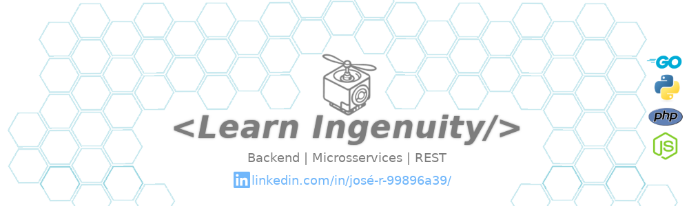
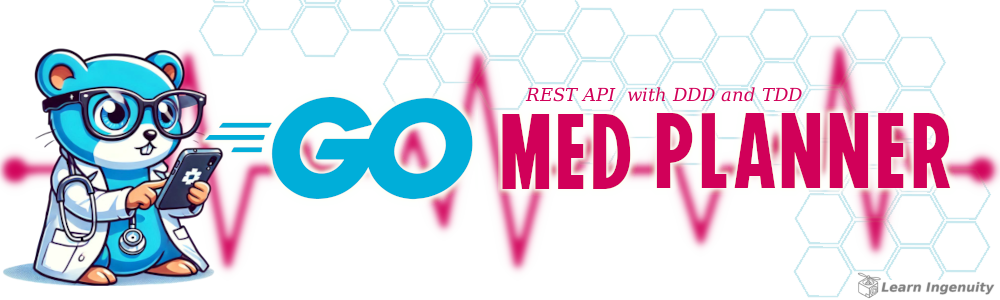
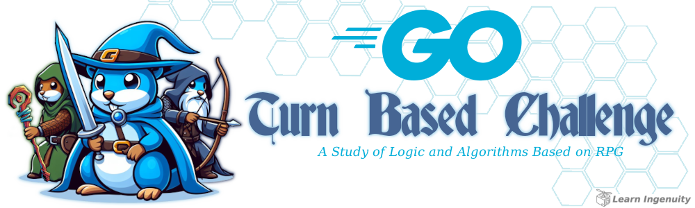
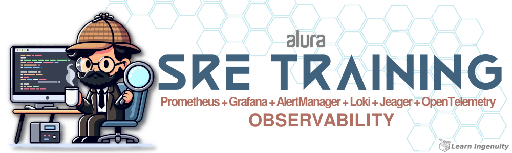
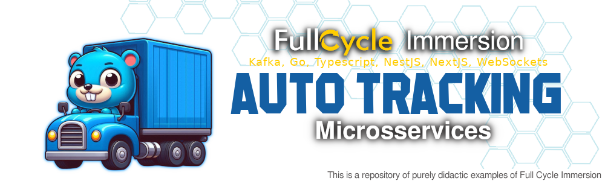

<a href="#header">
  <!-- 
      Logo image generated by Bing IA: https://www.bing.com/images/create/
  -->
   
</a>

     

---

###  Olá Mundo:
<!--
[ 
 -->
Olá Mundo, eu sou o __&nbsp;&nbsp;["Zé" (ou "Tony", depende de onde/quando nos conhecemos), Desenvolvedor](https://www.linkedin.com/in/jos%C3%A9-r-99896a39/)__ <!--com mais de 15 anos de experiência e -->, curioso e apaixonado por __resolver problemas de pessoas usando tecnologia__. Leitor constante de livros e artigos. Nos últimos anos tive foco em __Microsserviços e Grande Volume de Dados__. Estudando sobre como a IA e novas tecnologias impactam o mercado e a sociedade.

<!-- Explorando escrever [artigos](https://dev.to/learningenuity) como processo de documentação dos meus experimentos e leituras constantes -->

Durante a pandemia, me dediquei a __&nbsp;[ Robótica e IoT como hobby](https://github.com/jtonynet/autogo)__.

Bem-vindo ao meu GitHub!

 

- 🔭 Atualmente estou trabalhando em: _Aperfeiçoar minhas Skills_
- 🌱 Atualmente estou aprendendo: _[Observabilidade](https://github.com/jtonynet/jtonynet/tree/main/certificados/alura/SRE-Itau#header)_ e Boas Práticas
- 👯 Estou procurando colaborar em: _Ajudar sua empresa a Escalar_
- 💬 Pergunte-me sobre: _Microsserviços_
- 📫 Como entrar em _[Contato Comigo](#contacts)_
- 😄 Pronomes: _Ele, dele_
- 🎓 Meus _[Certificados e Cursos](https://github.com/jtonynet/jtonynet/tree/main/certificados/alura#header)_
- 📚 Minhas _[Leituras Recentes](https://github.com/jtonynet/jtonynet/tree/main/reading_diary#header)_
- ⚡ Curiosidade: _Sou Aquarista e Maker nas horas vagas_

 

`Lifelong learning!`

 

[⤴️ de volta ao menu](#header)

---

### 🕸️ Redes:

<!-- 
    https://dev.to/envoy_/150-badges-for-github-pnk
-->

  

 

[⤴️ de volta ao menu](#header)

---

### 📈 Estatísticas Git:

<!--
 
-->

 

<!--
  
 -->

 

[⤴️ de volta ao menu](#header)

---

### 🧰 Toolkit:

<!-- 
    icons by:
    https://devicon.dev/
    https://simpleicons.org/
-->
                   

 

[⤴️ de volta ao menu](#header)

---

### 🤖 Uso de IA:

O cabeçalho desta página foi criado com o auxílio de inteligência artificial e um mínimo de 
retoque e construção no Gimp 

<!-- O fundo é uma sessão de [Event Storming do youtube ](https://www.youtube.com/watch?v=6nEbm71Vc3w) dos meus [projetos recentes](https://github.com/jtonynet/cine-catalogo/tree/main) e pode ser encontrada no [Miro](https://miro.com/app/board/uXjVNRofMoA=/) com objetivo de aprendizado em público. -->

__Foram utilizados os seguintes prompts para sua criação no [Bing IA:](https://www.bing.com/images/create/)__

  
<b>Drone Ingenuity</b>

<i>"gostaria de uma logo MAIS SIMPLIFICADA O POSSIVEL em cores azul e DETALHES laranja CHAPADAS BEM DEFINIDAS em estilo cartoon/historia em quadrinhos do ROBO AEREO  que a nasa enviou para marte, Ingenuity, basicamente um CUBO com uma UNICA E SOMENTE UMA HELICE UM UNICO ROTOR, UM UNICO MOTOR  no MEIO, NO CENTRO em fundo branco para que seja facil tornar transparente em um editor de imagem"<b>(sic)</b></i>

 

IA também é utilizada em minhas pesquisas e estudos como ferramenta de apoio; no entanto, __artes e desenvolvimento são, sobretudo, atividades criativas humanas.__

Contrate artistas para projetos comerciais ou mais elaborados e Aprenda Engenhosidade!

 

[⤴️ de volta ao menu](#header)

---

### 🌟 Desafios e Estudos de Destaque:

Aqui você pode encontrar, através dos cabeçalhos e de uma breve descrição, meus projetos pessoais e treinamentos recentes, desenvolvidos com base em desafios práticos e estudos.

 

. . . . . . . . . . . . . . . . . . . . . . . . . . . .

 

#### ⚔️ Desafios:

> 

> <a href="https://github.com/jtonynet/go-payments-api?tab=readme-ov-file#header">
>
> | Go Payments API (A Hexagonal Approach)              |
> | -----------------------------------------------------|
> |  |
> 
> </a>
> 

>
>     
> 
> 
>
> Desafio de `Autorizador de Pagamentos` de benefícios em `Arquitetura Hexagonal` com `SLA de 100ms` por request e `controle de concorrência` com baixa possibilidade de colisão. 
> Construído com `Gin` e `Gorm`, protocolo `gRPC` entre o serviço "`REST`" `http` ("aberto" ao mundo, o ponto de entrada) e o serviço `Processor` ("fechado" ao mundo, o processador de pagamentos) por segurança.
>
> __Principais Tecnologias e abordagens:__
> - `Arquitetura Hexagonal`
> - `TDD`, `DDD`, `SOLID`, `ADRs`
> - `Diagram as code` com `Mermaid.js` e `Miro`
> - `Dockerized` Solução com uso de containers
> - `gRPC` e `http` entre `Microsservices`
> - `PostgreSQL` modelado inspirado em `Event Sourcing` para garantir `Consistência`
> - `CI` com `GitHub Actions` 
> - `Redis` para `Memory Lock Pessimista`
> - `Redis Keyspace Notification` como `Pub/Sub` para `Unlocks` (outras Abordagens como `Filas` foram desconsideradas devido `Latência Adicional`)
> - `Performance/Load Test Dockerized` com `Gatling` (WIP)
> 

<!--
 

. . . . . . . . . . . . . . . . . . . . . . . . . . . .

 

> 

> 
> | Go Med Planner (REST API Three Tier with DDD and TDD Approach)    |
> | ------------------------------------------------------------------|
> |  |
> 

>
> Desafio ...

 

. . . . . . . . . . . . . . . . . . . . . . . . . . . .

 

> 

> 
> | Go Pique Nique (A Hexagonal Banking Authorizer)      |
> | -----------------------------------------------------|
> |  |
> 

>
> Desafio ...

 

. . . . . . . . . . . . . . . . . . . . . . . . . . . .

 

> 

> 
> | Go Turn Based Challange (A Study of Logic and Algorithms Based on RPG)                 |
> | ---------------------------------------------------------------------------------------|
> |  |
> 

>
> Desafio ...
-->

 

 

#### 📑 Estudos e Imersões:

> 

> <a href="./certificados/alura/SRE-Itau">
> 
> | SRE Observability Training                           |
> | -----------------------------------------------------|
> |  |
> 
> </a>
> 

>
> 
>
> Repositório puramente didático, baseado no curso  `Observabilidade e SRE` com foco em `logs estruturados`, `monitoramento` e `alertas` para sistemas distribuídos. Implementado integração a ferramentas de observabilidade em uma aplicação previamente construida.
>
> __Principais Tecnologias e abordagens:__
> - `Grafana` e `Prometheus` para `dashboards` e `monitoramento de métricas`  
> - `Grafana Loki` para `centralização de logs`  
<!-- - `Jaeger` e `OpenTelemetry` para `tracing distribuído`  -->

<!-- 
 

. . . . . . . . . . . . . . . . . . . . . . . . . . . .

 

> 

> 
> | Auto Tracking FullCycle Immersion                    |
> | -----------------------------------------------------|
> |  |
> 

>
> 
>
>   
>
> Repositório puramente didático, baseado na `Imersão Full Stack && Full Cycle` iniciada em `09/12/2024`. Desenvolvendo Um sistema de rastreamento de veículos em tempo real utilizando microsserviços.
>
> __Principais Tecnologias e abordagens:__
> - `Nest.js`
> - `Next.js` no Front com a `API` do `GoogleMaps`
> - `Go`
> - `Apache Kafka` 
> - `Dockerized` Solução com uso de containers
 -->

<!--
 

. . . . . . . . . . . . . . . . . . . . . . . . . . . .

 

> 

> 
> | Go Hexagonal Calculator                              |
> | -----------------------------------------------------|
> |  |
> 

>
> Repositório puramente didático, baseado na `Tech Excellence Conference` de `22/11/2024`. Onde `Alistair Cockburn` apresentou um exemplo de `Calculadora em Java` para ilustrar sua abordagem `hexagonal`.
> 
> Aqui se encontra uma possível implementação dos conceitos apresentados na conferência em uma aplicação `Golang` visando aperfeiçoamento e treinamento.

 

. . . . . . . . . . . . . . . . . . . . . . . . . . . .

 

> 
> | Go Crypto Shredder (A LGPD/GDPR Database Anonymizer Approach) |
> | --------------------------------------------------------------|
> |  |

 

. . . . . . . . . . . . . . . . . . . . . . . . . . . .

 

-->

 

[⤴️ de volta ao menu](#header)

---

Todo projeto envolve trade-offs e dívidas técnicas. No entanto, é bem-sucedido quando atinge seus objetivos, seja impulsionando resultados de negócio ou promovendo melhorias contínuas e aprendizado durante sua _Jornada_.

>  _"Lifelong Learning & Prosper"_
>   
>  _Mr. Spock, maybe_   🖖🏾🚀

<a href="#footer">

  

</a>

