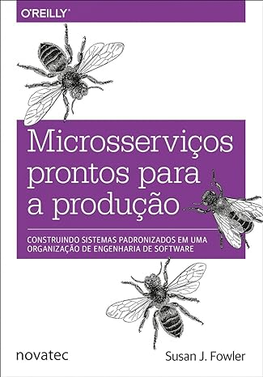
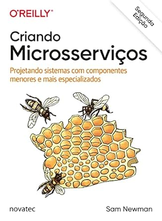
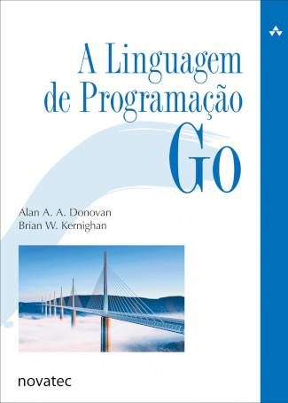

<!-- 
 Header image generated by Bing IA: https://www.bing.com/images/create/

Prompt:
APENAS tres Livros empilhados , em estilo cartoon com fundo branco sem muitos detalhes para que seja fácil tornar transparente em um editor de imagem
-->

 

Aqui se encontram breves resenhas das minhas __Leituras Técnicas Mais Recentes__ que fundamentam muitas das soluções aplicadas nos repositórios __&nbsp;[ Do Meu Perfil]()__. É uma amostra do que me é relevante e de leitura altamente recomendada.

Existe uma discussão sobre quão rápido os livros técnicos ficam defasados de acordo com os avanços das tecnologias e metodologias. Contudo, os livros de __Arquitetura & Abordagens__ tendem a ser mais resilientes e resistir ao _"teste do tempo"_ na maioria das vezes. No entanto, pouquíssimas coisas são _"à prova de futuro"_.

`Lifelong learning!`

---

### 🧠 Arquitetura & Abordagens

Livros focados em técnicas estruturais e seus usos em projetos. Eles podem recomendar linguagens, ferramentas ou tecnologias específicas, mas suas abordagens são agnósticas em relação a essas.

| Microsserviços Prontos para Produção                                                                                                                                                                  |                                                                                                                                 |
| ----------------------------------------------------------------------------------------------------------------------------------------------------------------------------------------------------- | ------------------------------------------------------------------------------------------------------------------------------- |
|  | Este livro fez parte de um estudo mais profundo em System Design que realizei, servindo como uma forte referência bibliográfica |

 ★★★☆☆ 

> **Microsserviço:**
> _Pequena aplicação, executa uma única tarefa e o faz com eficiência._
>
> _Fonte: Livro [Microsserviços Prontos para Produção](https://www.amazon.com.br/Microsservi%C3%A7os-Prontos-Para-Produ%C3%A7%C3%A3o-Padronizados/dp/8575226215)_

  
<b><u>Breve Resenha:</u></b>

    

    Susan Fowler, para além de seu período no Uber, tem o grande mérito de ter abordado o tema da <b>Disponibilidade</b> com uma visão completamente alinhada ao contexto dos microsserviços. Esse tema é de extrema importância para todos os cargos que compõem as equipes de tecnologia e negócios em um mundo onde os serviços são predominantemente digitais.
    

    

    A escalabilidade horizontal (em hyperescala), com a qual empresas bem-sucedidas em seus negócios na rede precisam lidar durante seu crescimento, não deve comprometer a confiabilidade das transações com as quais o sistema precisa lidar. Ao longo dos anos, a abordagem que parece ter se adaptado melhor para garantir essa confiabilidade em escala, embora não seja simples, são os microsserviços.
    

    

    Ela não se prende a tecnologias específicas, não cita ferramentas de forma incisiva, mas sim abordagens que visam atender aos requisitos dessa lista de verificação. Uma vez que a lista está preenchida, em sua visão, temos o que ela chama de "Microsserviços Prontos Para Produção."
    

    

    Nos sete capítulos da obra, a Engenheira de Confiabilidade discute os princípios que a nortearam na criação de uma lista de verificação que visa garantir que esses microsserviços suportem cargas de utilização pesadas, mesmo sob condições adversas, e não apenas isso, mas também sejam testáveis e de fácil manutenção.
    

 

. . . . . . . . . . . . . . . . . . . . . . . . . . . .

 

| Criando Microsserviços                                                                                                                                                          |                                                                                                |
| ------------------------------------------------------------------------------------------------------------------------------------------------------------------------------- | ---------------------------------------------------------------------------------------------- |
|  | __Altamente Recomendado__ e assim como o anterior me serve como forte referência bibliográfica |

 ★★★★★ 

> **Microsserviço**
> _Serviços que podem ser lançados de forma independente, modelados com base no serviço de negócios._
>
> _Fonte: Livro [Criando Microsserviços](https://www.amazon.com.br/gp/product/B09WF2MVT8/ref=dbs_a_def_rwt_bibl_vppi_i0)_

  
<b><u>Breve Resenha:</u></b>

    

    Gostaria de ter lido essa obra no período de lançamento. Teria sido MUITO útil em diversos desafios que enfrentei ao longo da minha jornada. O livro é denso e repleto de conceitos bem fundamentados. Li-o após o livro de Susan Fowler, e percebo que Newman apresenta uma visão mais abrangente sobre os tópicos que permeiam o tema de microsserviços, baseada em seus anos de experiência. Isso fica ainda mais evidente nesta segunda edição revisada.
    

    

    Partindo do princípio de que arquitetura não é uma corrida com obstáculos (embora muitas vezes pareça), Newman ressalta que monólitos são geralmente a decisão mais acertada até que problemas de escala, comuns ao crescimento de um negócio, comecem a surgir. Ele deixa claro que microsserviços não são a opção "padrão" nem um objetivo em si, mas sim uma estratégia para alcançar software disponível e escalável. Você não "vence" uma corrida simplesmente adotando esse padrão arquitetural.
    

    

    Com base nessa visão, o livro explora os conceitos de maneira abrangente, sugerindo ferramentas e abordagens que o autor adotou ao longo de sua carreira.
    

 

. . . . . . . . . . . . . . . . . . . . . . . . . . . .

 

Mais resenhas em breve ...

 
 

[⤴️ de volta ao menu](#header) - 🏠 [Voltar ao perfil](https://github.com/jtonynet)

---

 

### 👨‍💻 Linguagens

| A Linguagem de Programação Go                                                                                                                                                                 |                                                                                                                                                                                                                    |
| --------------------------------------------------------------------------------------------------------------------------------------------------------------------------------------------- | ------------------------------------------------------------------------------------------------------------------------------------------------------------------------------------------------------------------ |
|  | Um dos melhores livros sobre GoLang, embora um pouco defasado atualmente. Durante a leitura, era impossível não lembrar das antigas "Bíblias" de programação. No entanto, por sua didática, ainda vale a pena ler. |

 ★★★★☆ 

> **GoLang:**
> _Go é uma linguagem de programação de código aberto que facilita a criação de softwares simples, confiáveis e eficientes._
>
> _Fonte: [go.dev](https://go.dev/) citado no prefacio de [A Linguagem de Programação Go](https://www.amazon.com.br/Linguagem-Programa%C3%A7%C3%A3o-Go-Alan-Donovan/dp/8575225464/ref=sr_1_1)_

  
<b><u>Breve Resenha:</u></b>

    

    Um dos livros introdutórios mais recomendados para a linguagem Go, embora já com algum tempo desde seu lançamento, continua relevante devido à didática adotada. Meu primeiro contato com essa obra ocorreu na GopherCon 2018, quando o adquiri, e sua leitura, em conjunto com a documentação da linguagem, foi extremamente agradável.
    

    

    Executei alguns de seus <a href="https://github.com/jtonynet/go-book-exercises">Exemplos Práticos</a>, que, em conjunto com suas explicações, elucidam as bibliotecas padrão da linguagem. No geral, é um material que continua relevante, mas, devido à sua idade e ao fato de não apresentar um projeto de ponta a ponta (meu estilo favorito de aprender uma linguagem), "perdeu uma estrela no meu ranking pessoal de leituras técnicas."
    

 

. . . . . . . . . . . . . . . . . . . . . . . . . . . .

 

Mais resenhas em breve ...

 
 
 

[⤴️ de volta ao menu](#header) - 🏠 [Voltar ao perfil](https://github.com/jtonynet)

---

 

>  _"Lifelong Learning & Prosper"_
>   
>  _Mr. Spock, maybe_   🖖🏾🚀

